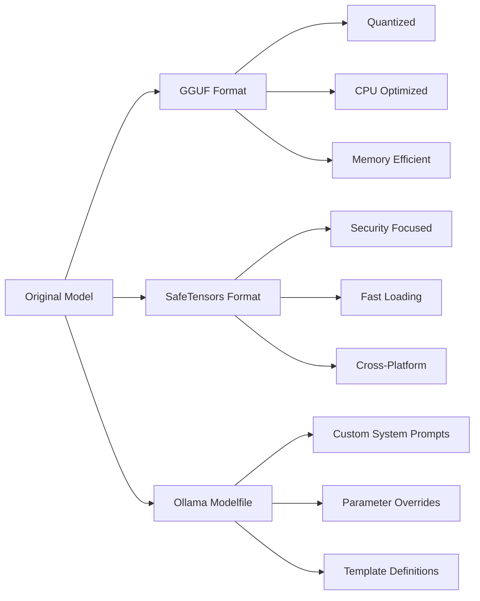

# Design Document

## Overview

The local LLMs module will be implemented as a new section in the course materials, specifically under `course_materials/07_local_llms/`. This module will provide comprehensive coverage of local Large Language Model deployment and usage, focusing on practical implementation with Ollama and Hugging Face Transformers. The design emphasizes hands-on learning through interactive notebooks, practical scripts, and visual explanations using Mermaid diagrams.

## Architecture

The module follows the established course structure pattern with organized subdirectories for different aspects of local LLM usage:

```mermaid
graph TD
    A[course_materials/07_local_llms/] --> B[README.md]
    A --> C[ollama_basics/]
    A --> D[huggingface_transformers/]
    A --> E[model_formats/]
    A --> F[system_prompts/]
    A --> G[setup_scripts/]
    A --> H[notebooks/]
    
    C --> C1[installation_guide.md]
    C --> C2[ollama_features.py]
    C --> C3[api_examples.py]
    C --> C4[model_management.py]
    
    D --> D1[transformers_setup.md]
    D --> D2[local_inference.py]
    D --> D3[memory_optimization.py]
    D --> D4[model_comparison.py]
    
    E --> E1[format_overview.md]
    E --> E2[gguf_examples.py]
    E --> E3[modelfile_creation.py]
    E --> E4[format_conversion.py]
    
    F --> F1[prompt_engineering.md]
    F --> F2[assistant_prompts.py]
    F --> F3[creative_prompts.py]
    F --> F4[specialized_prompts.py]
    
    G --> G1[install_ollama.sh]
    G --> G2[setup_python_env.sh]
    G --> G3[test_installation.py]
    G --> G4[troubleshooting.md]
    
    H --> H1[01_ollama_introduction.ipynb]
    H --> H2[02_transformers_basics.ipynb]
    H --> H3[03_model_formats_explained.ipynb]
    H --> H4[04_prompt_engineering.ipynb]
    H --> H5[05_performance_optimization.ipynb]
```



## Components and Interfaces

### 1. Ollama Integration Component

**Purpose:** Provide comprehensive coverage of Ollama usage for local LLM deployment

**Key Files:**
- `ollama_basics/installation_guide.md`: Step-by-step installation instructions
- `ollama_basics/ollama_features.py`: Demonstration of core Ollama features
- `ollama_basics/api_examples.py`: REST API and Python client examples
- `ollama_basics/model_management.py`: Model downloading, updating, and removal

**Interface Design:**
```python
class OllamaManager:
    def __init__(self, base_url: str = "http://localhost:11434"):
        self.base_url = base_url
    
    def list_models(self) -> List[str]:
        """List all available models"""
        pass
    
    def pull_model(self, model_name: str) -> bool:
        """Download a model from Ollama registry"""
        pass
    
    def generate_response(self, model: str, prompt: str, system: str = None) -> str:
        """Generate response using specified model"""
        pass
```

### 2. Hugging Face Transformers Component

**Purpose:** Demonstrate alternative approaches to local LLM deployment using Transformers

**Key Files:**
- `huggingface_transformers/transformers_setup.md`: Installation and configuration
- `huggingface_transformers/local_inference.py`: Basic inference examples
- `huggingface_transformers/memory_optimization.py`: Techniques for efficient memory usage
- `huggingface_transformers/model_comparison.py`: Performance comparisons between approaches

**Interface Design:**
```python
class TransformersManager:
    def __init__(self, model_name: str, device: str = "auto"):
        self.model_name = model_name
        self.device = device
        self.tokenizer = None
        self.model = None
    
    def load_model(self, quantization: bool = False):
        """Load model with optional quantization"""
        pass
    
    def generate_text(self, prompt: str, max_length: int = 100) -> str:
        """Generate text using the loaded model"""
        pass
```

### 3. Model Formats Component

**Purpose:** Educate users about different LLM model formats and their characteristics

**Key Files:**
- `model_formats/format_overview.md`: Comprehensive comparison of formats
- `model_formats/gguf_examples.py`: Working with GGUF format models
- `model_formats/modelfile_creation.py`: Creating custom Ollama Modelfiles
- `model_formats/format_conversion.py`: Converting between different formats

**Format Comparison Diagram:**


### 4. System Prompts Component

**Purpose:** Demonstrate how system prompts can modify model behavior for different use cases

**Key Files:**
- `system_prompts/prompt_engineering.md`: Best practices and techniques
- `system_prompts/assistant_prompts.py`: Helpful assistant configurations
- `system_prompts/creative_prompts.py`: Creative writing and storytelling prompts
- `system_prompts/specialized_prompts.py`: Code review, analysis, and domain-specific prompts

**Prompt Template Structure:**
```python
class PromptTemplate:
    def __init__(self, name: str, system_prompt: str, description: str):
        self.name = name
        self.system_prompt = system_prompt
        self.description = description
    
    def format_prompt(self, user_input: str) -> dict:
        return {
            "system": self.system_prompt,
            "user": user_input
        }
```

### 5. Setup and Installation Component

**Purpose:** Provide automated setup scripts for quick environment preparation

**Key Files:**
- `setup_scripts/install_ollama.sh`: Cross-platform Ollama installation
- `setup_scripts/setup_python_env.sh`: Python environment and dependencies
- `setup_scripts/test_installation.py`: Validation and testing scripts
- `setup_scripts/troubleshooting.md`: Common issues and solutions

### 6. Interactive Notebooks Component

**Purpose:** Provide hands-on learning experiences through Jupyter notebooks

**Key Files:**
- `notebooks/01_ollama_introduction.ipynb`: Getting started with Ollama
- `notebooks/02_transformers_basics.ipynb`: Hugging Face Transformers fundamentals
- `notebooks/03_model_formats_explained.ipynb`: Interactive format exploration
- `notebooks/04_prompt_engineering.ipynb`: Hands-on prompt experimentation
- `notebooks/05_performance_optimization.ipynb`: Optimization techniques and benchmarking

## Data Models

### Model Information Structure
```python
@dataclass
class ModelInfo:
    name: str
    format: str  # 'gguf', 'safetensors', 'ollama'
    size_gb: float
    parameters: str  # '7B', '13B', '70B'
    quantization: Optional[str]  # 'Q4_0', 'Q8_0', etc.
    description: str
    use_cases: List[str]
```

### Prompt Template Structure
```python
@dataclass
class PromptTemplate:
    name: str
    category: str  # 'assistant', 'creative', 'technical'
    system_prompt: str
    example_inputs: List[str]
    expected_behavior: str
    parameters: Dict[str, Any]
```

### Performance Metrics Structure
```python
@dataclass
class PerformanceMetrics:
    model_name: str
    inference_time_ms: float
    memory_usage_mb: float
    tokens_per_second: float
    quality_score: Optional[float]
    hardware_specs: Dict[str, str]
```

## Error Handling

### 1. Installation and Setup Errors
- **Network connectivity issues**: Provide offline alternatives and mirror suggestions
- **Insufficient system resources**: Clear hardware requirement documentation
- **Permission errors**: Detailed troubleshooting for different operating systems
- **Dependency conflicts**: Virtual environment isolation strategies

### 2. Model Loading Errors
- **Out of memory errors**: Automatic fallback to smaller models or quantized versions
- **Model not found**: Clear error messages with model availability checking
- **Format incompatibility**: Automatic format detection and conversion suggestions
- **Corrupted downloads**: Checksum verification and re-download mechanisms

### 3. Runtime Errors
- **API connection failures**: Retry mechanisms with exponential backoff
- **Generation timeouts**: Configurable timeout settings with progress indicators
- **Invalid prompts**: Input validation and sanitization
- **Resource exhaustion**: Graceful degradation and cleanup procedures

## Testing Strategy

### 1. Unit Testing
- **Model loading functions**: Test with various model formats and sizes
- **Prompt processing**: Validate template rendering and parameter substitution
- **API interactions**: Mock external services for reliable testing
- **Utility functions**: Comprehensive coverage of helper functions

### 2. Integration Testing
- **End-to-end workflows**: Complete user journeys from setup to inference
- **Cross-platform compatibility**: Testing on Linux, macOS, and Windows
- **Performance benchmarks**: Automated performance regression testing
- **Notebook execution**: Automated testing of all notebook cells

### 3. Educational Content Testing
- **Code example validation**: Ensure all code examples execute successfully
- **Documentation accuracy**: Regular review and update of installation guides
- **Link verification**: Automated checking of external references
- **Accessibility testing**: Ensure content is accessible to diverse learners

### 4. Performance Testing
- **Memory usage profiling**: Monitor resource consumption across different models
- **Inference speed benchmarking**: Compare performance across different approaches
- **Scalability testing**: Test behavior under various load conditions
- **Hardware compatibility**: Validate performance on different hardware configurations

## Implementation Considerations

### 1. Hardware Requirements
- **Minimum specifications**: Clear documentation of minimum system requirements
- **Recommended configurations**: Optimal hardware setups for different use cases
- **GPU acceleration**: Optional GPU support with fallback to CPU
- **Memory management**: Efficient memory usage patterns and cleanup

### 2. Educational Progression
- **Beginner-friendly introduction**: Start with simple concepts and build complexity
- **Hands-on examples**: Immediate practical application of concepts
- **Progressive difficulty**: Gradual increase in complexity throughout the module
- **Real-world applications**: Connect concepts to practical use cases

### 3. Maintenance and Updates
- **Version compatibility**: Support for multiple versions of dependencies
- **Regular content updates**: Keep pace with rapidly evolving LLM ecosystem
- **Community contributions**: Structure for accepting and reviewing contributions
- **Automated testing**: Continuous integration for content validation