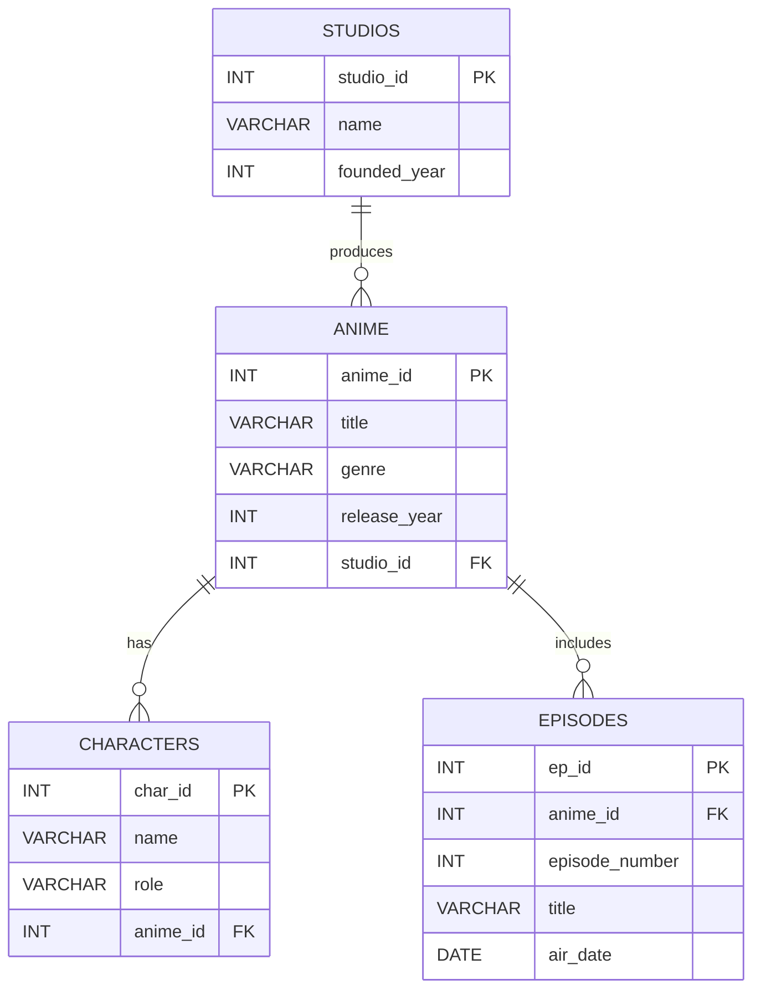
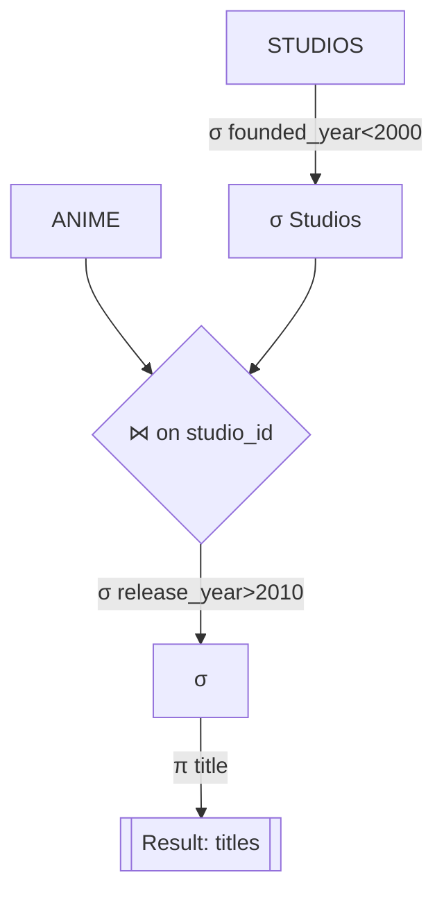
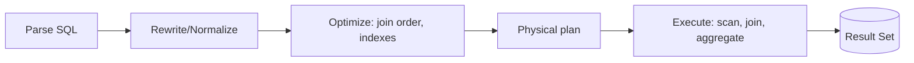

---
author:
- "[Shuvam Banerji Seal](https://shuvam-banerji-seal.github.io/)"
date: 2025-08-09
title: Relational Algebra and How to Form SQL Queries
---

## Why this guide

- Explain the core ideas of relational algebra (RA)
- Show how RA maps to SQL
- Provide visual intuition using ER and algebra trees
- Give clause-order templates for SQL you can reuse

> Note: Relational algebra uses set semantics by default; SQL uses bag (multiset) semantics. Use DISTINCT in SQL when you want set-like behavior.

---

## Example schema (used throughout)

We will reference a small anime-themed schema consistent with the course materials.



---

## Relational Algebra essentials

- A relation is a set of tuples with a fixed set of attributes.
- RA operators build new relations from existing ones.

| Symbol | Name           | Arity     | Intuition (set semantics)                                | Typical SQL analogue                     |
|--------|----------------|-----------|-----------------------------------------------------------|-------------------------------------------|
| σ      | Selection      | Unary     | Filter rows by predicate                                 | WHERE                                     |
| π      | Projection     | Unary     | Keep selected columns; remove duplicates                 | SELECT DISTINCT columns                   |
| ρ      | Rename         | Unary     | Rename relation/attributes                               | AS (aliases)                              |
| ×      | Cartesian prod | Binary    | All pairwise combinations                                | CROSS JOIN                                |
| ⋈θ     | Theta-join     | Binary    | Combine rows that satisfy join condition θ               | INNER JOIN ... ON condition               |
| ⋈      | Natural join   | Binary    | Join on all common attribute names (equijoin on equals)  | NATURAL JOIN (or explicit ON of equals)   |
| ∪      | Union          | Binary    | Combine sets, remove duplicates                          | UNION (not UNION ALL)                     |
| −      | Difference     | Binary    | Keep rows in left not in right                           | EXCEPT / MINUS (or LEFT JOIN ... IS NULL) |
| ∩      | Intersection   | Binary    | Keep rows present in both                                | INTERSECT (or INNER JOIN on equality)     |
| ÷      | Division       | Binary    | "For all" over related values                           | NOT EXISTS double-anti-join pattern       |
| γ      | Group/Aggreg.  | Unary     | Group rows; compute aggregates                           | GROUP BY, aggregates, HAVING               |

- Extended operators (outer joins) are common in SQL; in RA they are often considered derived/extended operators.

---

## Mapping RA to SQL: quick lookup

| RA form                                   | Meaning                                        | SQL sketch |
|-------------------------------------------|------------------------------------------------|------------|
| σ_{p}(R)                                  | Filter rows in R by predicate p                | SELECT * FROM R WHERE p; |
| π_{a1,...,ak}(R)                          | Keep only attributes a1..ak                    | SELECT DISTINCT a1,...,ak FROM R; |
| ρ_{S←R}(R)                                | Rename R to S                                  | SELECT ... FROM R AS S; |
| R × S                                     | Cartesian product                              | SELECT ... FROM R CROSS JOIN S; |
| R ⋈_{R.x=S.y} S                            | Theta/equi-join on condition                   | SELECT ... FROM R JOIN S ON R.x = S.y; |
| R ⋈ S                                      | Natural join on common attrs                   | SELECT ... FROM R NATURAL JOIN S; |
| R ∪ S                                     | Union without duplicates                       | SELECT ... FROM R UNION SELECT ... FROM S; |
| R − S                                     | Difference                                     | SELECT ... FROM R EXCEPT SELECT ... FROM S; |
| R ∩ S                                     | Intersection                                   | SELECT ... FROM R INTERSECT SELECT ... FROM S; |
| γ_{g; f1(...), f2(...)}(R)                | Group by g; aggregates f1,f2                   | SELECT g, f1(...), f2(...) FROM R GROUP BY g; |
| R ÷ S                                     | Tuples in R matching all S-values              | See NOT EXISTS pattern below |

Caveat: Many production engines (e.g., MariaDB) lack INTERSECT/EXCEPT and require emulation via JOIN/NOT EXISTS.

---

## Clause order and execution order

- SQL write order: SELECT -> FROM -> WHERE -> GROUP BY -> HAVING -> ORDER BY -> LIMIT
- SQL logical execution order (rough mental model): FROM -> WHERE -> GROUP BY -> HAVING -> SELECT -> DISTINCT -> ORDER BY -> LIMIT

| Clause       | Purpose                                  | Example |
|--------------|------------------------------------------|---------|
| FROM         | Choose source relations, joins           | FROM anime a JOIN studios s ON a.studio_id=s.studio_id |
| WHERE        | Row-level filtering                      | WHERE a.release_year >= 2010 |
| GROUP BY     | Form groups                              | GROUP BY a.studio_id |
| HAVING       | Filter groups by aggregate predicates    | HAVING COUNT(*) >= 2 |
| SELECT       | Choose columns / compute expressions     | SELECT a.title, s.name |
| DISTINCT     | Remove duplicates                        | SELECT DISTINCT a.genre |
| ORDER BY     | Sort result                              | ORDER BY a.release_year DESC |
| LIMIT/OFFSET | Trim result set                          | LIMIT 10 OFFSET 20 |

---

## SQL templates you can reuse

- Basic filter

```sql
SELECT a.title, a.genre
FROM anime AS a
WHERE a.release_year >= 2010;
```

- Join

```sql
SELECT a.title, s.name AS studio_name
FROM anime AS a
JOIN studios AS s ON s.studio_id = a.studio_id;
```

- Group and aggregate

```sql
SELECT a.studio_id, COUNT(*) AS num_titles
FROM anime AS a
GROUP BY a.studio_id
HAVING COUNT(*) >= 2;
```

- Set operation (remove duplicates)

```sql
SELECT title AS name FROM anime
UNION
SELECT name FROM characters;
```

---

## Visual intuition: algebra tree for a join-filter-project

Query (natural language): titles of anime produced by studios founded before 2000, released after 2010.

- RA: π_{title}( σ_{release_year>2010}( ANIME ⋈_{ANIME.studio_id=STUDIOS.studio_id} σ_{founded_year<2000}(STUDIOS) ) )



SQL counterpart:

```sql
SELECT a.title
FROM anime AS a
JOIN studios AS s ON s.studio_id = a.studio_id
WHERE s.founded_year < 2000
  AND a.release_year > 2010;
```

---

## Division ("for all") pattern in SQL

Goal: find studio_ids whose anime cover all genres in a required list.

- RA sketch: π_{studio_id}( π_{studio_id, genre}(ANIME) ÷ REQUIRED_GENRES )

- SQL (NOT EXISTS / double anti-join):

```sql
WITH required_genres(genre) AS (
  SELECT 'Fantasy' UNION ALL
  SELECT 'Action'
)
SELECT a.studio_id
FROM anime AS a
GROUP BY a.studio_id
HAVING COUNT(DISTINCT CASE WHEN a.genre IN (SELECT genre FROM required_genres) THEN a.genre END)
       = (SELECT COUNT(*) FROM required_genres);
```

---

## Extra: how SQL engines execute (high level)



Use EXPLAIN in your RDBMS to see the chosen physical plan.
