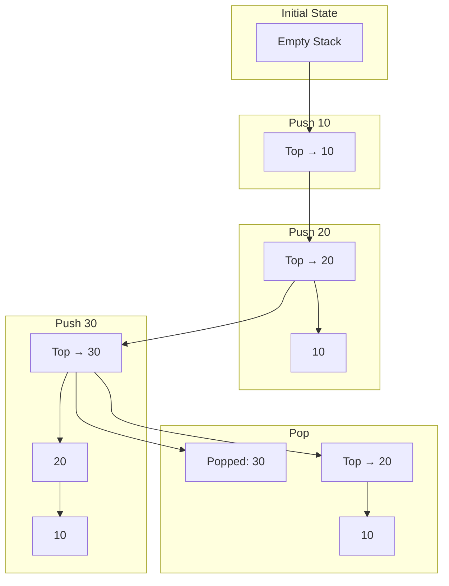
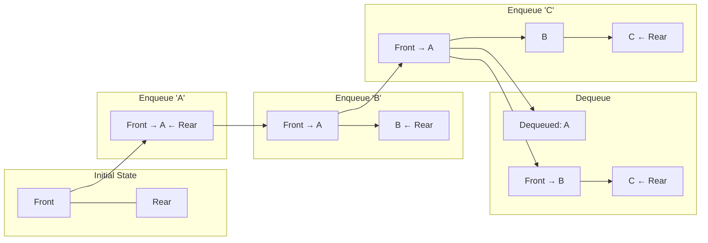

# Visualizing Data Structures with Mermaid

This document provides visual explanations for the data structures implemented in the Python notebook, using Mermaid diagrams to illustrate their core concepts and operations.

## 1. The Stack (Last-In, First-Out)

A Stack is a data structure that follows the **LIFO (Last-In, First-Out)** principle. New elements are added to the top, and elements are also removed from the top. Think of it like a stack of books; you add a new book to the top and take one from the top.

### Operations: Push and Pop

-   **Push**: Adds an item to the top of the stack.
-   **Pop**: Removes the item from the top of the stack.

The diagram below shows the state of a stack as we push three items (10, 20, 30) and then pop one.


*In the final step, `30` is popped because it was the last one in. The new top becomes `20`.*

## 2. The Queue (First-In, First-Out)

A Queue follows the **FIFO (First-In, First-Out)** principle. Elements are added to one end (the **rear**) and removed from the other end (the **front**). This is exactly like a checkout line at a store.

### Operations: Enqueue and Dequeue

-   **Enqueue**: Adds an item to the rear of the queue.
-   **Dequeue**: Removes an item from the front of the queue.

This diagram illustrates a queue where we enqueue 'A', 'B', and 'C', and then dequeue an item.


*'A' is dequeued because it was the first one in. The new front of the queue becomes 'B'.*

## 3. The Linked List

A Linked List is a sequence of **Nodes**, where each node stores its own data and a pointer to the next node in the sequence. Unlike an array, nodes are not stored in contiguous memory locations. The list is accessed starting from the `head` node.

### Structure and Operations

The diagram below shows a linked list after appending the values `10`, `20`, and `30`, and then deleting the node with the value `20`.

```mermaid
graph TD
    subgraph Initial List
      Head1["Head"] --> Node10["Node (10)"] --> Node20["Node (20)"] --> Node30["Node (30)"] --> Null1["None"]
    end

    subgraph Delete Node(20)
        subgraph Explanation
            direction LR
            Step1("1. Find Node(20) and its previous node, Node(10).")
            Step2("2. Change the 'next' pointer of Node(10) to point to Node(20)'s next node, which is Node(30).")
        end
      Head2["Head"] --> NewNode10["Node (10)"]
      NewNode10 -- "Update Pointer" --> NewNode30["Node (30)"] --> Null2["None"]
      style NewNode10 fill:#f9f,stroke:#333,stroke-width:2px
    end
    
    Initial List --> Delete Node(20)```
*To delete `Node(20)`, we simply reroute the `next` pointer from the previous node (`Node(10)`) to bypass it, effectively removing it from the chain.*

## 4. The Binary Search Tree (BST)

A Binary Search Tree is a hierarchical node-based structure where every node has at most two children. It follows a strict ordering property:

-   The key of a node's **left** child is always **less than** the parent's key.
-   The key of a node's **right** child is always **greater than** the parent's key.

This property makes searching for values extremely efficient.

### Structure Example

The following diagram shows a BST created by inserting the numbers `50, 30, 70, 20, 40, 60, 80` in that order.

```mermaid
graph TD
    subgraph BST Structure
        Root["(50)"]
        Root --> Left1["(30)"]
        Root --> Right1["(70)"]
        
        Left1 --> Left2["(20)"]
        Left1 --> Right2["(40)"]
        
        Right1 --> Left3["(60)"]
        Right1 --> Right4["(80)"]

        style Root fill:#f96,stroke:#333,stroke-width:2px
    end
```
