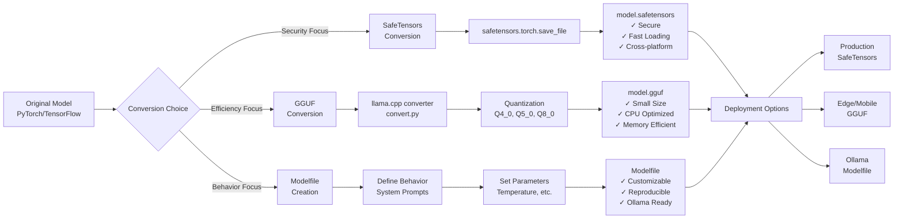
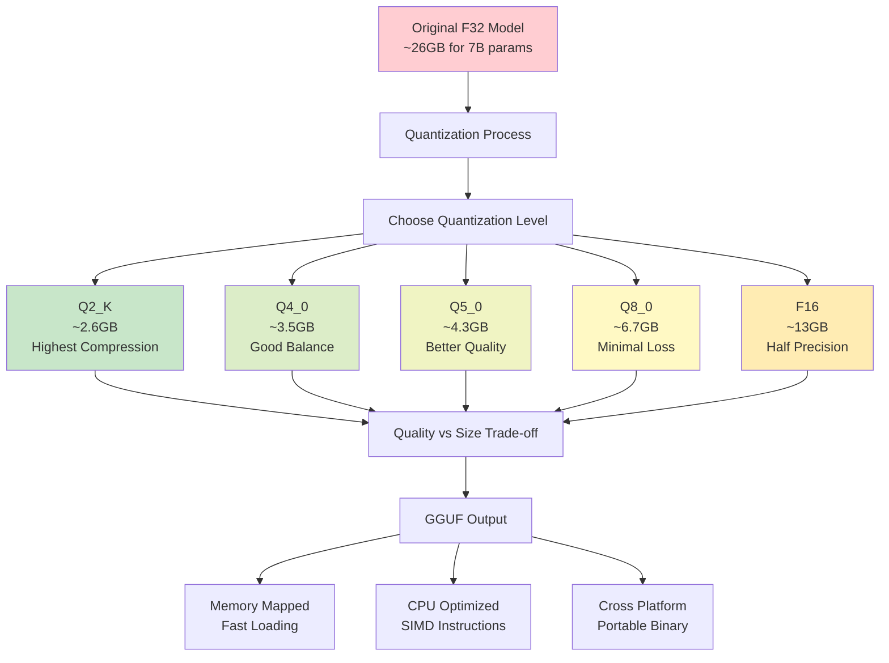
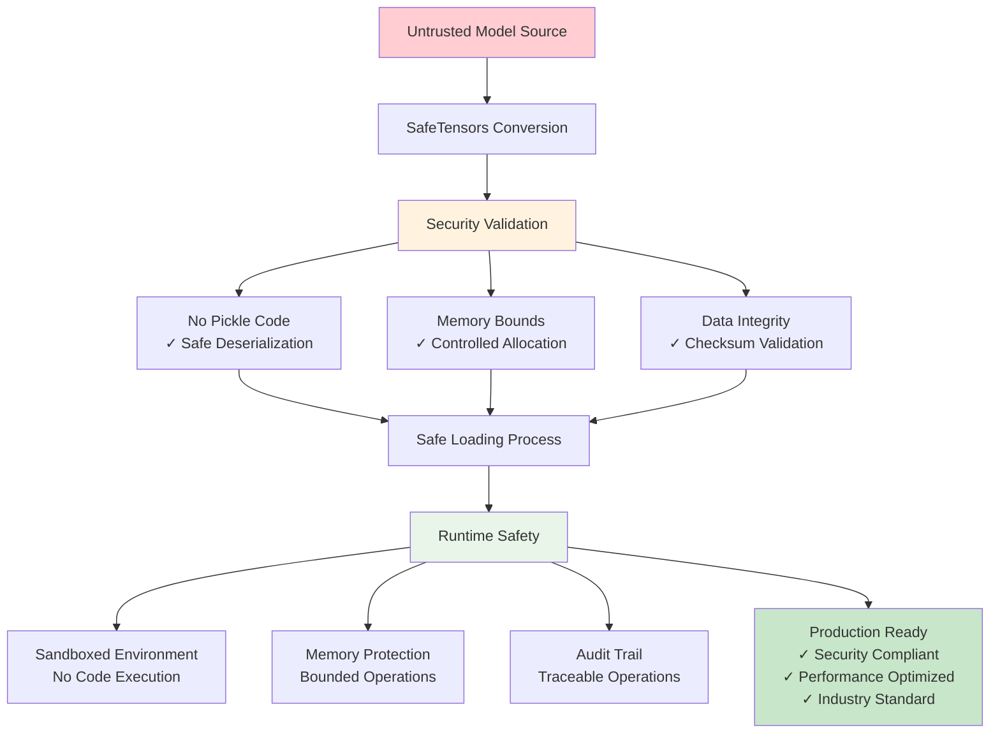
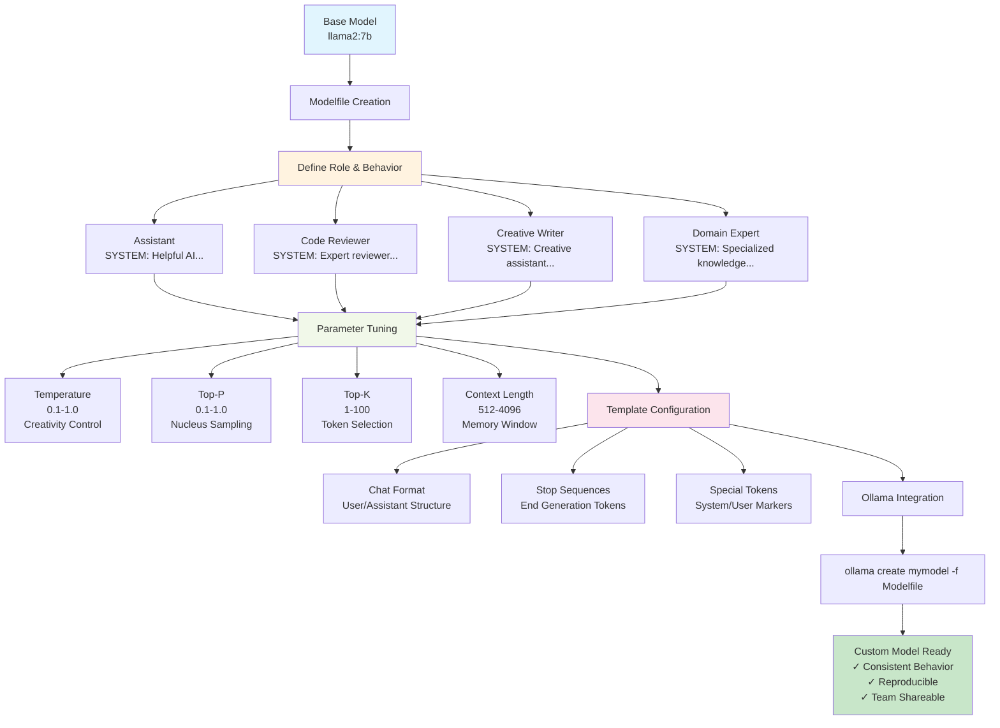
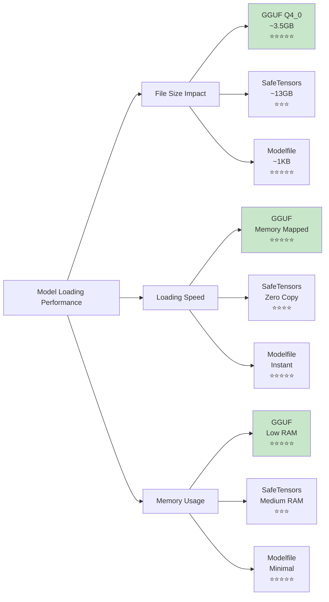
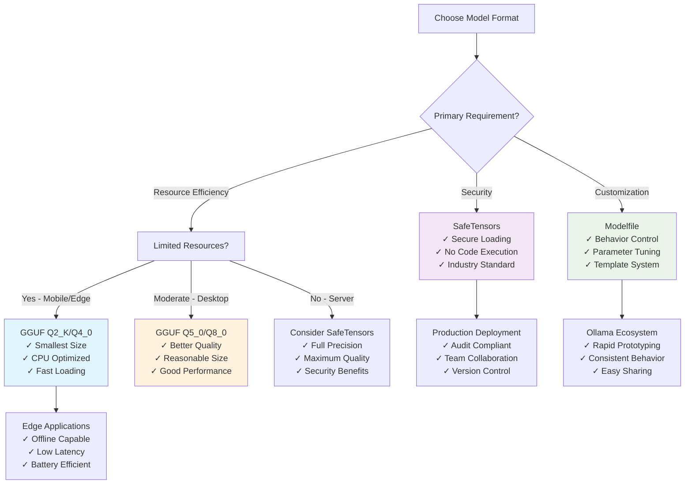
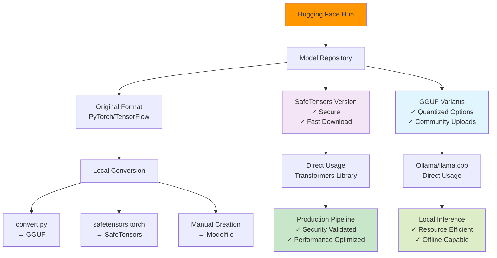
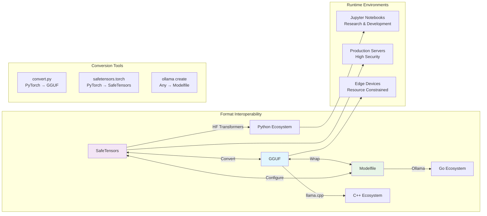
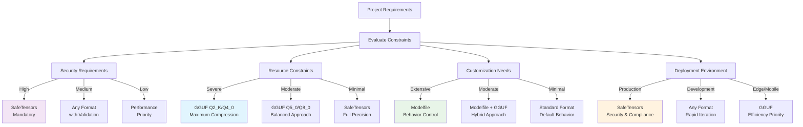

# Model Format Visualization Diagrams

This document provides visual representations of different LLM model formats, their structures, and conversion workflows using Mermaid diagrams.

## Format Structure Comparison

### Overall Format Architecture


### GGUF Internal Structure

```mermaid
graph TD
    A[GGUF File] --> B[Magic Number<br/>GGUF]
    B --> C[Version Info<br/>3]
    C --> D[Tensor Count<br/>N]
    D --> E[Metadata Count<br/>M]
    
    E --> F[Metadata Entries]
    F --> F1[general.architecture<br/>llama]
    F --> F2[general.parameter_count<br/>7B]
    F --> F3[tokenizer.ggml.model<br/>llama]
    F --> F4[quantization.version<br/>2]
    
    E --> G[Tensor Info Array]
    G --> G1[Tensor 1<br/>Name: token_embd.weight<br/>Dims: [32000, 4096]<br/>Type: Q4_0]
    G --> G2[Tensor 2<br/>Name: output_norm.weight<br/>Dims: [4096]<br/>Type: F32]
    G --> G3[Tensor N<br/>Name: output.weight<br/>Dims: [32000, 4096]<br/>Type: Q4_0]
    
    G --> H[Tensor Data]
    H --> H1[Quantized Weights<br/>Memory Mapped]
    H --> H2[Bias Data<br/>If Present]
    H --> H3[Additional Tensors<br/>Layer by Layer]
    
    style A fill:#e1f5fe
    style F fill:#fff3e0
    style G fill:#f1f8e9
    style H fill:#fce4ec
```

### SafeTensors Structure

```mermaid
graph TD
    A[SafeTensors File] --> B[Header Length<br/>8 bytes]
    B --> C[JSON Header]
    C --> C1[Tensor Metadata<br/>{<br/>  "weight": {<br/>    "dtype": "F32",<br/>    "shape": [4096, 4096],<br/>    "data_offsets": [0, 67108864]<br/>  }<br/>}]
    
    C --> D[Tensor Data Section]
    D --> D1[Tensor 1 Data<br/>Raw Binary]
    D --> D2[Tensor 2 Data<br/>Contiguous Layout]
    D --> D3[Tensor N Data<br/>No Padding]
    
    D --> E[Integrity Features]
    E --> E1[No Code Execution]
    E --> E2[Memory Safe Loading]
    E --> E3[Built-in Validation]
    
    style A fill:#f3e5f5
    style C1 fill:#fff3e0
    style D fill:#f1f8e9
    style E fill:#e8f5e8
```

### Modelfile Structure

```mermaid
graph TD
    A[Modelfile] --> B[FROM Directive<br/>FROM llama2:7b]
    
    B --> C[SYSTEM Block]
    C --> C1[System Prompt<br/>SYSTEM """<br/>You are a helpful assistant...<br/>"""]
    
    B --> D[PARAMETER Block]
    D --> D1[temperature 0.7]
    D --> D2[top_p 0.9]
    D --> D3[top_k 40]
    D --> D4[repeat_penalty 1.1]
    D --> D5[num_ctx 2048]
    
    B --> E[TEMPLATE Block]
    E --> E1[Chat Template<br/>TEMPLATE """<br/>{{ if .System }}...<br/>{{ end }}<br/>"""]
    
    B --> F[ADAPTER Block]
    F --> F1[LoRA Adapters<br/>ADAPTER ./lora-adapter]
    
    B --> G[LICENSE Block]
    G --> G1[License Info<br/>LICENSE """<br/>MIT License<br/>"""]
    
    style A fill:#e8f5e8
    style C1 fill:#fff3e0
    style D fill:#f1f8e9
    style E1 fill:#fce4ec
    style F1 fill:#e1f5fe
```

## Format Conversion Workflows

### Complete Model Pipeline



### GGUF Quantization Process



### SafeTensors Security Pipeline



### Modelfile Customization Workflow



## Performance Comparison Visualization

### Loading Speed Comparison



### Use Case Decision Tree



## Format Ecosystem Integration

### Hugging Face Hub Integration



### Cross-Format Compatibility



## Best Practices Visualization

### Format Selection Strategy



This comprehensive visualization guide provides clear understanding of model format structures, conversion processes, and decision-making frameworks for choosing the appropriate format for different use cases.