# Ollama Architecture and System Diagrams

This document provides visual explanations of Ollama's architecture, components, and workflows using Mermaid diagrams.

## Table of Contents

1. [High-Level Architecture](#high-level-architecture)
2. [Model Management Workflow](#model-management-workflow)
3. [Request Processing Flow](#request-processing-flow)
4. [API Interaction Patterns](#api-interaction-patterns)
5. [Model Storage Structure](#model-storage-structure)
6. [Client-Server Communication](#client-server-communication)
7. [GPU Acceleration Flow](#gpu-acceleration-flow)
8. [Error Handling Flow](#error-handling-flow)

## High-Level Architecture

The following diagram shows the overall architecture of Ollama and how its components interact:

```mermaid
graph TB
    subgraph "Client Applications"
        CLI[Ollama CLI]
        API[REST API Clients]
        PY[Python Scripts]
        WEB[Web Applications]
    end
    
    subgraph "Ollama Server"
        HTTP[HTTP Server<br/>Port 11434]
        ROUTER[Request Router]
        AUTH[Authentication<br/>(Optional)]
        
        subgraph "Core Engine"
            LOAD[Model Loader]
            INFER[Inference Engine]
            CACHE[Response Cache]
            QUEUE[Request Queue]
        end
        
        subgraph "Model Management"
            REGISTRY[Model Registry]
            DOWNLOAD[Download Manager]
            STORAGE[Model Storage]
            VALIDATE[Model Validator]
        end
    end
    
    subgraph "System Resources"
        CPU[CPU Cores]
        RAM[System RAM]
        GPU[GPU Memory<br/>(Optional)]
        DISK[Disk Storage]
    end
    
    subgraph "External Services"
        HF[Hugging Face Hub]
        OLLAMA_REG[Ollama Registry]
        CUSTOM[Custom Registries]
    end
    
    CLI --> HTTP
    API --> HTTP
    PY --> HTTP
    WEB --> HTTP
    
    HTTP --> ROUTER
    ROUTER --> AUTH
    AUTH --> LOAD
    AUTH --> INFER
    AUTH --> REGISTRY
    
    LOAD --> CACHE
    INFER --> CACHE
    LOAD --> QUEUE
    INFER --> QUEUE
    
    REGISTRY --> DOWNLOAD
    DOWNLOAD --> STORAGE
    STORAGE --> VALIDATE
    
    LOAD --> CPU
    LOAD --> RAM
    INFER --> CPU
    INFER --> RAM
    INFER --> GPU
    STORAGE --> DISK
    
    DOWNLOAD --> HF
    DOWNLOAD --> OLLAMA_REG
    DOWNLOAD --> CUSTOM
```

### Architecture Components Explained

**Client Layer:**
- **Ollama CLI**: Command-line interface for direct interaction
- **REST API Clients**: Applications using HTTP API endpoints
- **Python Scripts**: Custom scripts using requests or ollama library
- **Web Applications**: Browser-based interfaces

**Server Layer:**
- **HTTP Server**: Handles incoming requests on port 11434
- **Request Router**: Routes requests to appropriate handlers
- **Authentication**: Optional security layer for access control

**Core Engine:**
- **Model Loader**: Loads models into memory for inference
- **Inference Engine**: Processes prompts and generates responses
- **Response Cache**: Caches responses for improved performance
- **Request Queue**: Manages concurrent requests

**Model Management:**
- **Model Registry**: Tracks available and installed models
- **Download Manager**: Handles model downloads with progress tracking
- **Model Storage**: Manages local model files and metadata
- **Model Validator**: Verifies model integrity and compatibility

## Model Management Workflow

This diagram illustrates how models are discovered, downloaded, and managed:

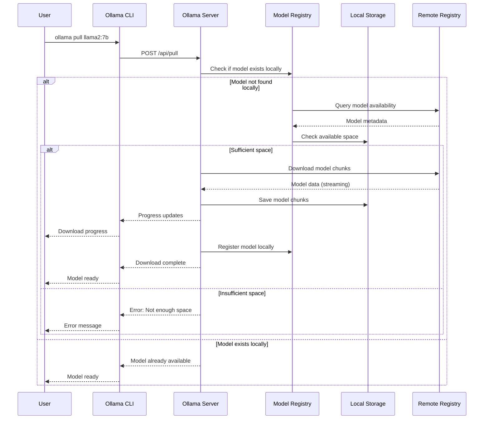

### Model Management States

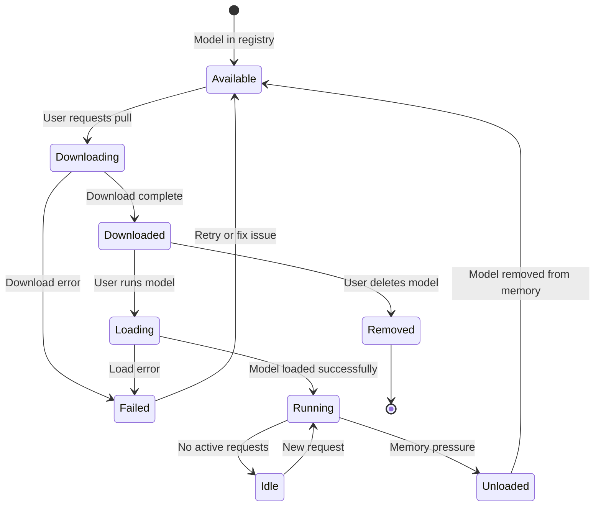

## Request Processing Flow

This diagram shows how requests are processed from client to response:

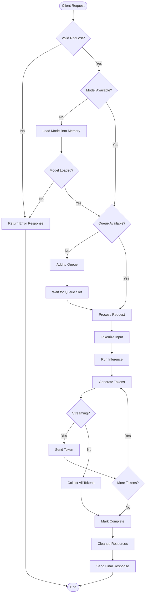

## API Interaction Patterns

### Synchronous Generation Pattern

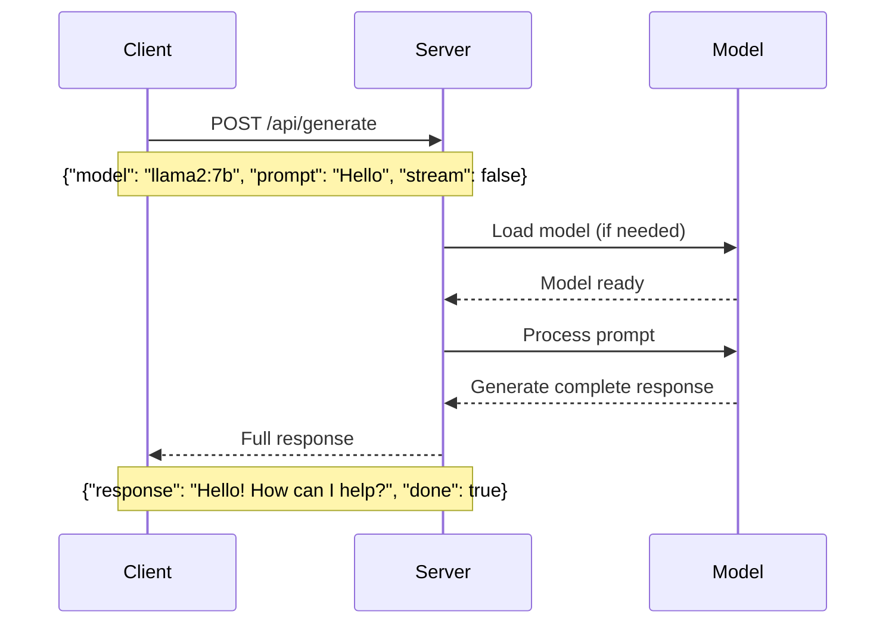

### Streaming Generation Pattern

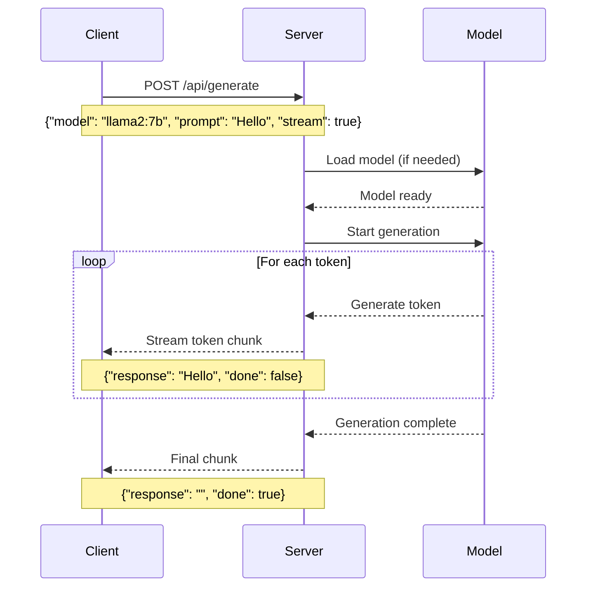

### Chat Conversation Pattern

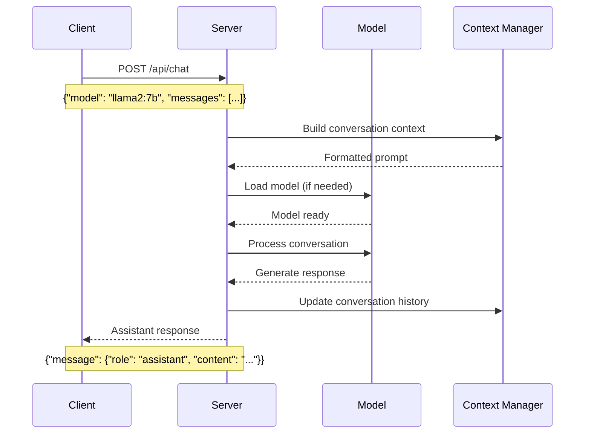

## Model Storage Structure

This diagram shows how models are organized in the local file system:

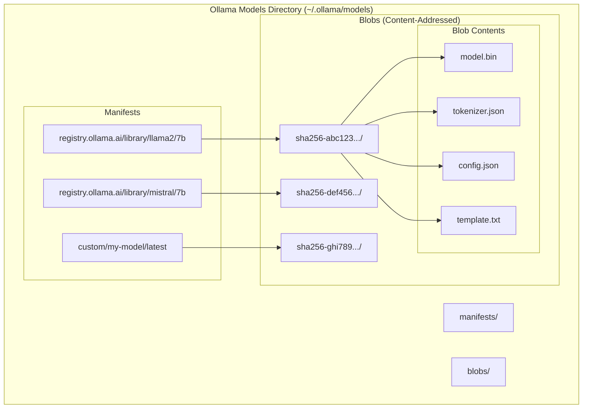

### Storage Organization Explained

**Manifests Directory:**
- Contains metadata for each model
- Organized by registry/namespace/model/tag structure
- Points to actual content blobs via SHA256 hashes

**Blobs Directory:**
- Content-addressed storage using SHA256 hashes
- Enables deduplication across models
- Contains actual model files, tokenizers, and configurations

**Benefits of this Structure:**
- **Deduplication**: Shared components between models stored once
- **Integrity**: Content-addressed storage ensures data integrity
- **Efficiency**: Only download changed components during updates
- **Organization**: Clear separation between metadata and content

## Client-Server Communication

### HTTP API Endpoints

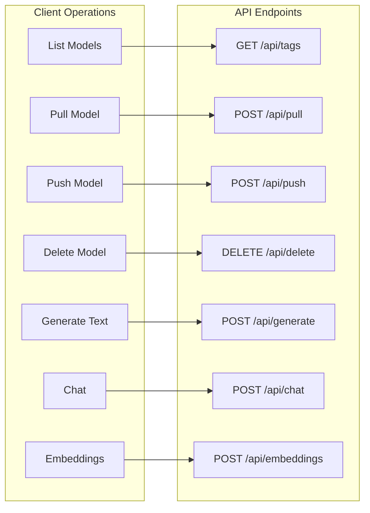

### Request/Response Flow

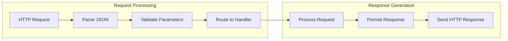

## GPU Acceleration Flow

This diagram shows how GPU acceleration is utilized when available:

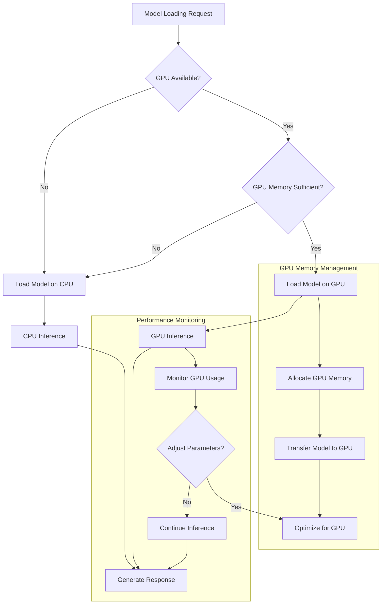

### GPU vs CPU Performance Comparison

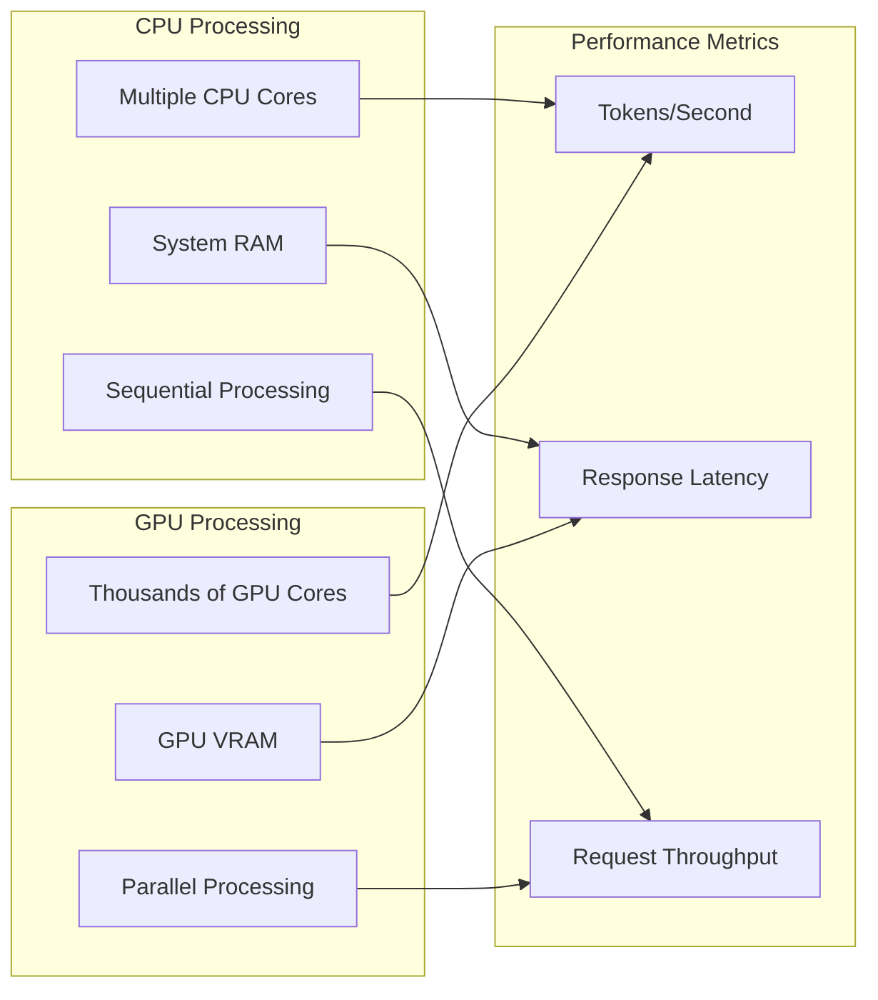

## Error Handling Flow

This diagram illustrates how different types of errors are handled:

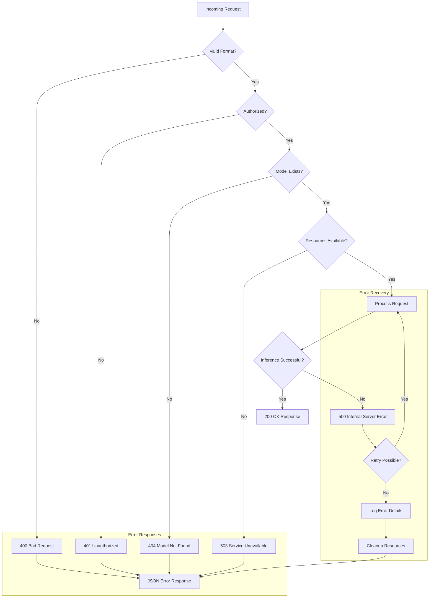

### Error Types and Handling

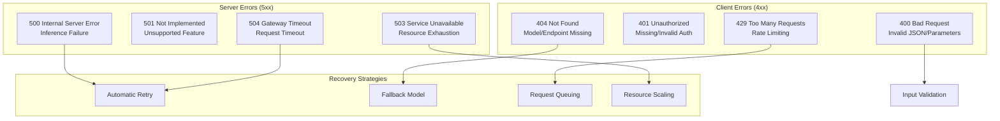

## System Integration Patterns

### Microservices Integration

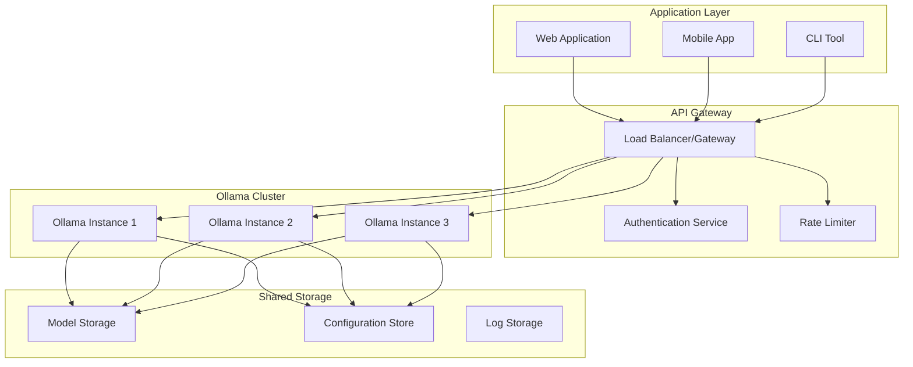

## Conclusion

These diagrams provide a comprehensive view of Ollama's architecture and operational patterns. Understanding these flows helps in:

1. **Troubleshooting**: Identifying where issues might occur in the system
2. **Optimization**: Understanding bottlenecks and performance characteristics
3. **Integration**: Planning how to integrate Ollama into larger systems
4. **Development**: Building applications that effectively use Ollama's capabilities

For hands-on experience with these concepts, refer to:
- `api_examples.py` - Practical API usage examples
- `model_management.py` - Model management operations
- `ollama_features.py` - Feature demonstrations
- `installation_guide.md` - Setup and configuration details