# 🦙 Ollama: Your Local AI Powerhouse

<div align="center">

<div align="center">

<svg width="200" height="120" xmlns="http://www.w3.org/2000/svg">
  <defs>
    <linearGradient id="grad1" x1="0%" y1="0%" x2="100%" y2="100%">
      <stop offset="0%" style="stop-color:#667eea;stop-opacity:1" />
      <stop offset="100%" style="stop-color:#764ba2;stop-opacity:1" />
    </linearGradient>
  </defs>
  <rect width="200" height="120" fill="url(#grad1)" rx="15"/>
  <text x="100" y="40" font-family="Arial, sans-serif" font-size="24" font-weight="bold" text-anchor="middle" fill="white">🦙 Ollama</text>
  <text x="100" y="65" font-family="Arial, sans-serif" font-size="12" text-anchor="middle" fill="white">Local AI Made Simple</text>
  <text x="100" y="85" font-family="Arial, sans-serif" font-size="10" text-anchor="middle" fill="white">Slashdot Programming Club</text>
  <text x="100" y="100" font-family="Arial, sans-serif" font-size="8" text-anchor="middle" fill="white">IISER Kolkata • 2025-2026</text>
</svg>

</div>


**Presented by: Shuvam Banerji Seal**  
*OB, Slashdot Programming Club*  
*IISER Kolkata • 2025-2026*

</div>

---

## 📋 Table of Contents

- [What is Ollama?](#what-is-ollama)
- [Installation Guide](#installation-guide)
- [Getting Started](#getting-started)
- [Model Management](#model-management)
- [Advanced Customizations](#advanced-customizations)
- [API Integration](#api-integration)
- [Performance Optimization](#performance-optimization)
- [Use Cases & Examples](#use-cases--examples)
- [Troubleshooting](#troubleshooting)

---

## 🤖 What is Ollama?

Ollama is a lightweight, extensible framework for building and running large language models locally. It provides a simple API for creating, running, and managing models, making AI accessible without cloud dependencies.


### Key Features

- 🚀 **Local Execution**: Run models entirely on your machine
- 🔧 **Easy Setup**: Simple installation and model management
- 🌐 **REST API**: Integrate with any programming language
- 📦 **Model Library**: Access to popular open-source models
- ⚡ **Performance**: Optimized for various hardware configurations

---

## 🛠️ Installation Guide

### Linux/macOS Installation

```bash
# Download and install Ollama
curl -fsSL https://ollama.ai/install.sh | sh

# Alternative: Manual download
# Visit https://ollama.ai/download and download for your platform
```

### Windows Installation

```powershell
# Download the Windows installer from https://ollama.ai/download
# Run the .exe file and follow the installation wizard
```

### Verification

```bash
# Check if Ollama is installed correctly
ollama --version

# Start the Ollama service
ollama serve
```


---

## 🚀 Getting Started

### Your First Model

```bash
# Run your first model (downloads automatically)
ollama run gemma3:1b

# Try other popular models
ollama run codellama
ollama run mistral
ollama run phi
```

### Basic Commands

```bash
# List available models
ollama list

# Show model information
ollama show llama2

# Remove a model
ollama rm llama2

# Update a model
ollama pull llama2:latest
```

### Interactive Chat

```bash
# Start an interactive session
ollama run llama2

# Example conversation:
>>> Hello! Can you help me with Python?
# Model responds with helpful Python information

# Exit with /bye or Ctrl+D
>>> /bye
```

---

## 📦 Model Management

### Available Models


### Model Variants

```bash
# Different parameter sizes
ollama run llama2:7b      # 7 billion parameters
ollama run llama2:13b     # 13 billion parameters
ollama run llama2:70b     # 70 billion parameters

# Quantized versions (smaller, faster)
ollama run llama2:7b-q4_0    # 4-bit quantization
ollama run llama2:7b-q8_0    # 8-bit quantization
```

### Custom Model Creation

```bash
# Create a Modelfile
cat > Modelfile << EOF
FROM llama2

# Set custom parameters
PARAMETER temperature 0.8
PARAMETER top_p 0.9
PARAMETER top_k 40

# Set system message
SYSTEM """
You are a helpful programming assistant specialized in Python and web development.
Always provide code examples and explain your reasoning.
"""
EOF

# Build your custom model
ollama create my-coding-assistant -f Modelfile

# Use your custom model
ollama run my-coding-assistant
```

### Modelfile Storage Locations

Ollama stores models and Modelfiles in different locations depending on your operating system:

```bash
# Linux
~/.ollama/models/
# Example: ~/.ollama/models/manifests/registry.ollama.ai/library/llama2/

# macOS
~/.ollama/models/
# Example: ~/.ollama/models/manifests/registry.ollama.ai/library/llama2/

# Windows
%USERPROFILE%\.ollama\models\
# Example: C:\Users\YourName\.ollama\models\manifests\registry.ollama.ai\library\llama2\
```

You can also set a custom location using environment variables:

```bash
# Set custom model directory
export OLLAMA_MODELS=/path/to/your/models

# On Windows (PowerShell)
$env:OLLAMA_MODELS="C:\path\to\your\models"
```

---

## ⚙️ Advanced Customizations

### Modelfile Parameters

```dockerfile
FROM llama2

# Temperature: Controls randomness (0.0 to 2.0)
PARAMETER temperature 0.7

# Top-p: Nucleus sampling (0.0 to 1.0)
PARAMETER top_p 0.9

# Top-k: Limits token selection
PARAMETER top_k 40

# Repeat penalty: Reduces repetition
PARAMETER repeat_penalty 1.1

# Context window size
PARAMETER num_ctx 4096

# System prompt
SYSTEM """You are a helpful AI assistant."""

# Custom template
TEMPLATE """{{ if .System }}<|system|>
{{ .System }}<|end|>
{{ end }}{{ if .Prompt }}<|user|>
{{ .Prompt }}<|end|>
{{ end }}<|assistant|>
{{ .Response }}<|end|>
"""
```

### Environment Configuration

```bash
# Set custom data directory
export OLLAMA_MODELS=/path/to/models

# Configure host and port
export OLLAMA_HOST=0.0.0.0:11434

# Set GPU layers (for NVIDIA GPUs)
export OLLAMA_NUM_GPU_LAYERS=35

# Memory settings
export OLLAMA_MAX_LOADED_MODELS=2
export OLLAMA_MAX_QUEUE=512
```

### Hardware Optimization


---

## 🔌 API Integration

### REST API Basics

```bash
# Start Ollama server
ollama serve

# Server runs on http://localhost:11434
```

### Python Integration

```python
import requests
import json

def chat_with_ollama(prompt, model="llama2"):
    url = "http://localhost:11434/api/generate"
    
    payload = {
        "model": model,
        "prompt": prompt,
        "stream": False
    }
    
    response = requests.post(url, json=payload)
    return response.json()["response"]

# Example usage
response = chat_with_ollama("Explain quantum computing in simple terms")
print(response)
```

### JavaScript Integration

```javascript
async function chatWithOllama(prompt, model = 'llama2') {
    const response = await fetch('http://localhost:11434/api/generate', {
        method: 'POST',
        headers: {
            'Content-Type': 'application/json',
        },
        body: JSON.stringify({
            model: model,
            prompt: prompt,
            stream: false
        })
    });
    
    const data = await response.json();
    return data.response;
}

// Example usage
chatWithOllama("Write a Python function to sort a list")
    .then(response => console.log(response));
```

### Streaming Responses

```python
import requests
import json

def stream_chat(prompt, model="llama2"):
    url = "http://localhost:11434/api/generate"
    
    payload = {
        "model": model,
        "prompt": prompt,
        "stream": True
    }
    
    with requests.post(url, json=payload, stream=True) as response:
        for line in response.iter_lines():
            if line:
                chunk = json.loads(line)
                if not chunk.get("done"):
                    print(chunk["response"], end="", flush=True)

# Example usage
stream_chat("Tell me a story about a programmer")
```

---

## ⚡ Performance Optimization

### System Requirements

```mermaid
graph TD
    A[Model Size] --> B{System RAM}
    B -->|8GB+| C[7B Models ✅]
    B -->|16GB+| D[13B Models ✅]
    B -->|32GB+| E[34B Models ✅]
    B -->|64GB+| F[70B Models ✅]
    
    G[GPU VRAM] --> H{Available VRAM}
    H -->|4GB+| I[Partial GPU Offload]
    H -->|8GB+| J[Most 7B Models]
    H -->|16GB+| K[Most 13B Models]
    H -->|24GB+| L[Large Models]
    
    style C fill:#4caf50
    style D fill:#4caf50
    style E fill:#4caf50
    style F fill:#4caf50
```



### Optimization Tips

```bash
# 1. Use quantized models for better performance
ollama run llama2:7b-q4_0  # 4-bit quantization

# 2. Adjust GPU layers based on VRAM
OLLAMA_NUM_GPU_LAYERS=20 ollama run llama2

# 3. Limit concurrent models
OLLAMA_MAX_LOADED_MODELS=1 ollama serve

# 4. Optimize context window
# In Modelfile:
PARAMETER num_ctx 2048  # Smaller context = faster inference
```

### Monitoring Performance

```python
import psutil
import time
import requests

def monitor_ollama_performance():
    """Monitor Ollama performance metrics"""
    
    # CPU and Memory usage
    cpu_percent = psutil.cpu_percent(interval=1)
    memory = psutil.virtual_memory()
    
    # GPU usage (if nvidia-ml-py installed)
    try:
        import pynvml
        pynvml.nvmlInit()
        handle = pynvml.nvmlDeviceGetHandleByIndex(0)
        gpu_util = pynvml.nvmlDeviceGetUtilizationRates(handle)
        gpu_memory = pynvml.nvmlDeviceGetMemoryInfo(handle)
        
        print(f"GPU Utilization: {gpu_util.gpu}%")
        print(f"GPU Memory: {gpu_memory.used/1024**3:.1f}GB / {gpu_memory.total/1024**3:.1f}GB")
    except:
        print("GPU monitoring not available")
    
    print(f"CPU Usage: {cpu_percent}%")
    print(f"RAM Usage: {memory.percent}%")
    print(f"Available RAM: {memory.available/1024**3:.1f}GB")

# Run monitoring
monitor_ollama_performance()
```

---

## 💡 Use Cases & Examples

### 1. Code Assistant

```python
# Create a specialized coding assistant
cat > CodingAssistant << EOF
FROM codellama

SYSTEM """
You are an expert programming assistant. You help with:
- Code review and optimization
- Debugging and troubleshooting  
- Best practices and design patterns
- Multiple programming languages

Always provide working code examples and explain your reasoning.
"""

PARAMETER temperature 0.3
PARAMETER top_p 0.9
EOF

ollama create coding-buddy -f CodingAssistant
```

### 2. Research Assistant

```bash
# Research-focused model
cat > ResearchAssistant << EOF
FROM llama2

SYSTEM """
You are a research assistant for computer science students. You help with:
- Explaining complex algorithms and data structures
- Research paper summaries
- Mathematical concepts in CS
- Academic writing assistance

Provide detailed explanations with examples and references when possible.
"""

PARAMETER temperature 0.5
PARAMETER num_ctx 8192
EOF

ollama create research-helper -f ResearchAssistant
```

### 3. Web Development Helper

```javascript
// Express.js integration example
const express = require('express');
const axios = require('axios');

const app = express();
app.use(express.json());

app.post('/api/code-review', async (req, res) => {
    const { code } = req.body;
    
    const prompt = `Review this code and suggest improvements:\n\n${code}`;
    
    try {
        const response = await axios.post('http://localhost:11434/api/generate', {
            model: 'coding-buddy',
            prompt: prompt,
            stream: false
        });
        
        res.json({ review: response.data.response });
    } catch (error) {
        res.status(500).json({ error: 'Failed to get code review' });
    }
});

app.listen(3000, () => {
    console.log('Code review API running on port 3000');
});
```

### 4. Batch Processing

```python
import asyncio
import aiohttp
import json

async def process_multiple_prompts(prompts, model="llama2"):
    """Process multiple prompts concurrently"""
    
    async def process_single(session, prompt):
        async with session.post(
            'http://localhost:11434/api/generate',
            json={
                'model': model,
                'prompt': prompt,
                'stream': False
            }
        ) as response:
            data = await response.json()
            return data['response']
    
    async with aiohttp.ClientSession() as session:
        tasks = [process_single(session, prompt) for prompt in prompts]
        results = await asyncio.gather(*tasks)
        return results

# Example usage
prompts = [
    "Explain binary search",
    "What is machine learning?",
    "How does HTTP work?",
    "Describe the MVC pattern"
]

results = asyncio.run(process_multiple_prompts(prompts))
for i, result in enumerate(results):
    print(f"Prompt {i+1}: {result[:100]}...")
```

---

## 🔧 Troubleshooting

### Common Issues


### Debug Commands

```bash
# Check Ollama service status
ollama ps

# View detailed model information
ollama show llama2 --verbose

# Check system resources
ollama info

# View logs (Linux/macOS)
journalctl -u ollama -f

# Test API connectivity
curl http://localhost:11434/api/tags
```

### Performance Issues

```bash
# 1. Out of Memory
# Solution: Use smaller models or increase swap
ollama run llama2:7b-q4_0  # Instead of llama2:70b

# 2. Slow Inference
# Solution: Optimize GPU usage
OLLAMA_NUM_GPU_LAYERS=35 ollama run llama2

# 3. Model Won't Load
# Solution: Check available space and re-download
ollama rm llama2
ollama pull llama2

# 4. API Timeouts
# Solution: Increase timeout in client code
# Python example:
requests.post(url, json=payload, timeout=300)  # 5 minutes
```

---

## 🎯 Best Practices for Slashdot Club

### Development Workflow


### Club Project Ideas

1. **AI-Powered Code Reviewer**
   - Integrate with Git hooks
   - Automated code quality checks
   - Style guide enforcement

2. **Research Paper Summarizer**
   - Process academic papers
   - Generate abstracts
   - Extract key findings

3. **Interactive Learning Assistant**
   - CS concept explanations
   - Algorithm visualizations
   - Practice problem generation

4. **Documentation Generator**
   - Auto-generate API docs
   - Code comment enhancement
   - README file creation

### Security Considerations

```bash
# 1. Network Security
# Bind to localhost only (default)
export OLLAMA_HOST=127.0.0.1:11434

# 2. Model Verification
# Always verify model sources
ollama show llama2 | grep "Family"

# 3. Resource Limits
# Set memory limits to prevent system overload
ulimit -v 8388608  # 8GB virtual memory limit

# 4. Access Control
# Use reverse proxy for production deployments
# nginx configuration example in production
```

---

## 📚 Additional Resources

### Official Documentation
- [Ollama GitHub Repository](https://github.com/ollama/ollama)
- [Model Library](https://ollama.ai/library)
- [API Documentation](https://github.com/ollama/ollama/blob/main/docs/api.md)

### Community Resources
- [Ollama Discord Community](https://discord.gg/ollama)
- [Reddit r/ollama](https://reddit.com/r/ollama)
- [Awesome Ollama Projects](https://github.com/topics/ollama)

### Learning Materials
- [Hugging Face Model Hub](https://huggingface.co/models)
- [LangChain Integration](https://python.langchain.com/docs/integrations/llms/ollama)
- [OpenAI API Compatibility](https://github.com/ollama/ollama/blob/main/docs/openai.md)

---

<div align="center">


<svg width="300" height="80" xmlns="http://www.w3.org/2000/svg">
  <defs>
    <linearGradient id="grad2" x1="0%" y1="0%" x2="100%" y2="0%">
      <stop offset="0%" style="stop-color:#ff6b6b;stop-opacity:1" />
      <stop offset="50%" style="stop-color:#4ecdc4;stop-opacity:1" />
      <stop offset="100%" style="stop-color:#45b7d1;stop-opacity:1" />
    </linearGradient>
  </defs>
  <rect width="300" height="80" fill="url(#grad2)" rx="10"/>
  <text x="150" y="30" font-family="Arial, sans-serif" font-size="16" font-weight="bold" text-anchor="middle" fill="white">Happy Coding with Ollama! 🦙</text>
  <text x="150" y="50" font-family="Arial, sans-serif" font-size="12" text-anchor="middle" fill="white">Slashdot Programming Club</text>
  <text x="150" y="65" font-family="Arial, sans-serif" font-size="10" text-anchor="middle" fill="white">IISER Kolkata • 2025-2026</text>
</svg>


**Questions? Reach out to the Slashdot Programming Club!**

*Prepared by: Shuvam Banerji Seal, OB 2025-2026*

</div>

---

*This guide is designed for educational purposes and club discussions. Feel free to experiment, contribute, and share your Ollama experiences with the community!*