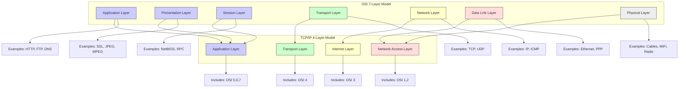

```mermaid
flowchart TB

%% OSI Layers
subgraph OSI_Model [OSI 7-Layer Model]
    osi7[Application Layer]
    osi6[Presentation Layer]
    osi5[Session Layer]
    osi4[Transport Layer]
    osi3[Network Layer]
    osi2[Data Link Layer]
    osi1[Physical Layer]
end

%% TCP/IP Layers
subgraph TCPIP_Model [TCP/IP 4-Layer Model]
    tcp4[Application Layer]
    tcp3[Transport Layer]
    tcp2[Internet Layer]
    tcp1[Network Access Layer]
end

%% Mapping arrows
osi7 --> tcp4
osi6 --> tcp4
osi5 --> tcp4
osi4 --> tcp3
osi3 --> tcp2
osi2 --> tcp1
osi1 --> tcp1

%% Labels for clarity
osi7:::app --> D1[Examples: HTTP, FTP, DNS]
osi6:::app --> D2[Examples: SSL, JPEG, MPEG]
osi5:::app --> D3[Examples: NetBIOS, RPC]
osi4:::trans --> D4[Examples: TCP, UDP]
osi3:::net --> D5[Examples: IP, ICMP]
osi2:::link --> D6[Examples: Ethernet, PPP]
osi1:::phy --> D7[Examples: Cables, WiFi, Radio]

tcp4:::app --> T1[Includes: OSI 5,6,7]
tcp3:::trans --> T2[Includes: OSI 4]
tcp2:::net --> T3[Includes: OSI 3]
tcp1:::link --> T4[Includes: OSI 1,2]

%% Styling
classDef app fill:#ccf,stroke:#333,stroke-width:1px;
classDef trans fill:#cfc,stroke:#333,stroke-width:1px;
classDef net fill:#ffc,stroke:#333,stroke-width:1px;
classDef link fill:#fdd,stroke:#333,stroke-width:1px;
classDef phy fill:#eee,stroke:#333,stroke-width:1px;

class osi7,osi6,osi5,osi4,osi3,osi2,osi1 app,trans,net,link,phy;
class tcp4,tcp3,tcp2,tcp1 app,trans,net,link;
```