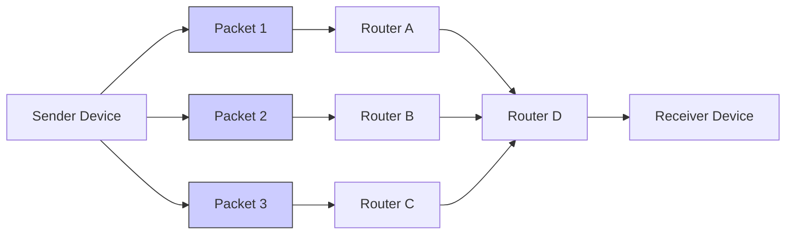
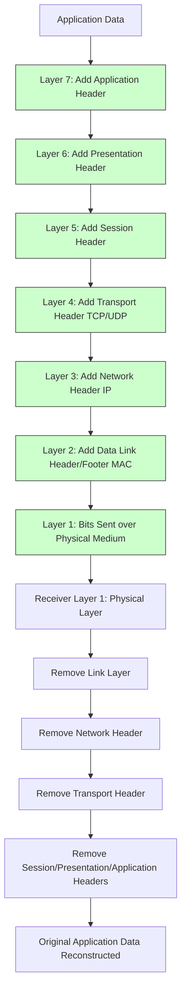
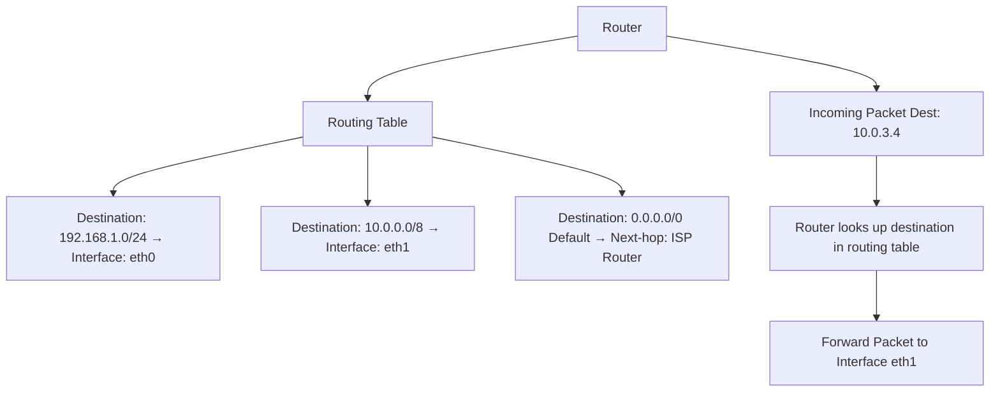
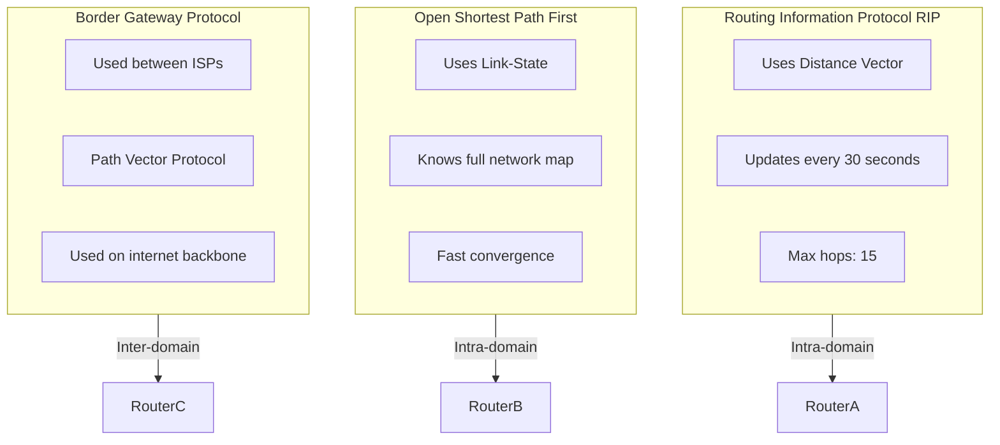
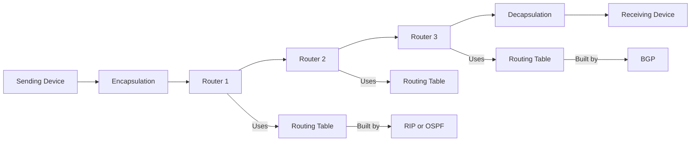
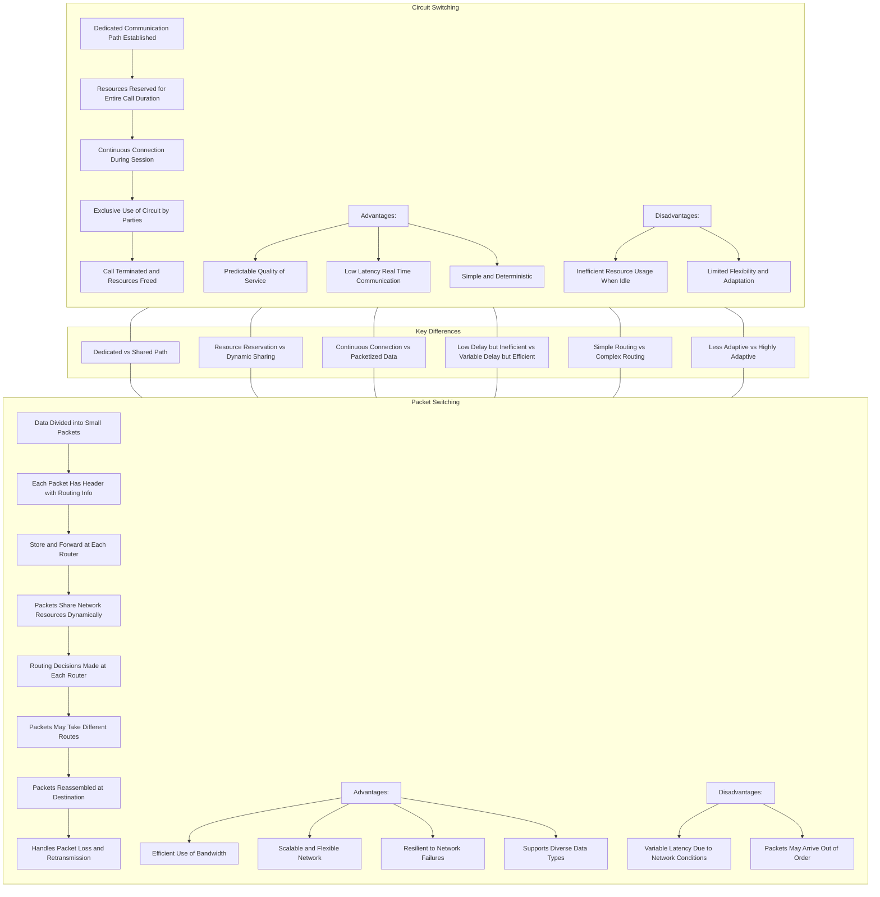

## 1. 📦 Packet Switching

### 📘 Explanation:

* Data is broken into small **packets**.
* Each packet can take a different **route** to the destination.
* Routers forward packets based on routing tables.
* Final device **reassembles** the packets in order.

---

## 2. 🧳 Encapsulation & Decapsulation

### 📘 Explanation:

* Each layer **adds its own header** to the data = **Encapsulation**.
* Receiver removes headers in reverse = **Decapsulation**.
* Happens in both OSI and TCP/IP models.

---

## 3. 📡 Routers and Routing Tables

### 📘 Explanation:

* Each router has a **routing table**.
* It maps destination networks to the correct **interface** or **next-hop**.
* Default route (`0.0.0.0/0`) is used for all unknown destinations (i.e., internet).

---

## 4. 🧭 Routing Protocols: RIP, OSPF, BGP

### 📘 Explanation:

| Protocol | Type            | Use Case            | Metric Used      | Notes             |
| -------- | --------------- | ------------------- | ---------------- | ----------------- |
| RIP      | Distance Vector | Small networks      | Hop count        | Simple, slow      |
| OSPF     | Link-State      | Enterprise networks | Cost (bandwidth) | Fast convergence  |
| BGP      | Path Vector     | Internet-level      | Policy, path     | Used between ASes |

---

## ✅ Summary Visual Flow

